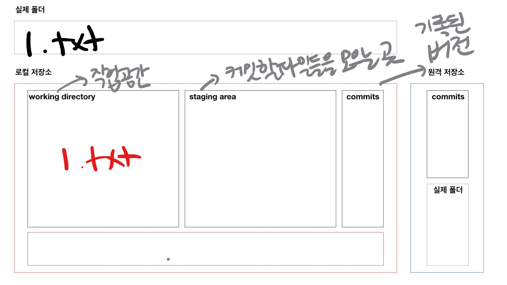

# Git - 기초문법

> 분산버전관리시스템(DVCS)

## 준비사항

* [git bash](https://gitforwindows.org/)(윈도우 사용하는 경우 필요)

## 기본 문법

### 0.git 저장소 생성

```bash
$ git init
#비어있는 git 저장소(ropository) 초기화...
#test 폴더에(절대경로) .git폴더에
Initialized empty Git repository in C:/Users/cjdau/Desktop/test/.git/
```

* 폴더에 git 저장소를 초기화 하면,

  * `.git` 폴더가 생성이 되고
  * bash에는 `(master)`라고 표시가 된다

* 주의 사항!

  * git 저장소 내에 git 저장소를 만들지 말것!!!!

    * `git init` 명령어를 입력할때 (master)가 보이면 절대!!! 입력하지 말것

      -상위 폴더가 git 저장소라는 의미이므로 중복저장소가 발생하여 안됨 

### 1. add

```bash
$ git add {디렉토리}
$ git add . #현재 디렉토리(하위 디렉토리 포함)
$ git add a.txt #특정 파일
$ git add myfolder/ #특정 폴더
```

* working directory 상태의 파일을 staging area 상태로 변경 (첫번쨰 통 -> 두번째 통)
* 커밋을 위한 파일들을 추가하는 명령어!

### 예시

```bash
$ touch a. txt #파일을 만든다 => 코드 작업을 했다
$ git status
On branch master

No commits yet
# Untracked files: 트래킹x 파일들
# git으로 관리된 적 없는 파일들.. 예) 파일 생성
Untracked files:
# git add 명령어를 사용하라
#커밋이 될곳에 포함 시키기 위하여
  (use "git add <file>..." to include in what will be committed)
        a.txt #<-- 빨간색
#총평..
nothing added to commit but untracked files present (use "git add" to track)

```

git add . 이후 반응

```bash
$ git status
On branch master

No commits yet

Changes to be committed:
  (use "git rm --cached <file>..." to unstage)
        new file:   a.txt

```

## 2. commit

```bash
$ git commit -m 'Add a.txt'
[master (root-commit) a62cbb3] Add a.txt
 1 file changed, 0 insertions(+), 0 deletions(-)
 create mode 100644 a.txt
```

* 커밋을 통하여 하나의 버전으로 기록된다.
* 커밋 메세지는 현재 변경사항들을 잘 나타낼 수 있도록 작성하자.
* 커밋은 고유한 아이디인 해시값을 가진다.
  * SHA-1 알고리즘에 의하여 생성.
* 커밋 목록은 git log 명령어를 통하여 확인할 수 있다..jpg)

## 3. log

```bash
$ git log

commit a62cbb3fc345779200d3e473611a4715a8a4ba47 (HEAD -> master)
Author: Cheong Myeong Noh <cjdauddl93@gmail.com>
Date:   Thu Jun 3 15:35:28 2021 +0900

    Add a.txt
    
$ git log --oneline #한줄로
a62cbb3 (HEAD -> master) Add a.txt

$ git log -2 #2개
$ git log --oneline -1 #1개를 한줄로
```

## 4. status

* working 

```bash
$ git status
On branch master
nothing to commit, working tree clean
```

_LI.jpg)


