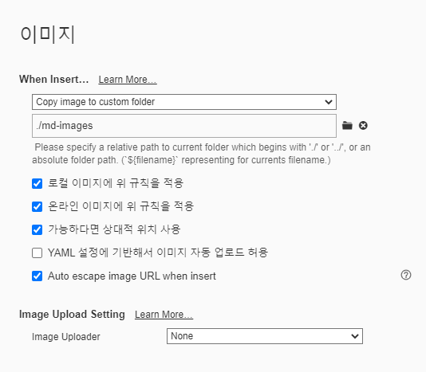

 # 마크다운 문법

## 제목 (heading)

문서의 구조를 잡기위하여 사용된다. 제목의 레벨에 맞춰 #으로 표현한다. 개수에 따라 level이 달리짐

`을 이용하면 샾을 포함한 기호들을 알 수 있다. 

* 순서가 없는 목록 `*`
* 순서가 없음
  * tap

엔터

쉬프트탭으로 탈출

엔터 엔터로 나가짐

1. 순서가있는목록

## 코드 블록

인라인 코드 블록 `def`

```python
print('hello')
def foo();
	return True
```

html 예시

```html
<!-- 주석 -->
<h1>
    안녕하세요
</h1>
```

# 표

| 순번 | 이름 |      |
| ---- | ---- | ---- |
| 1    |      |      |
| 2    |      |      |
| 3    |      |      |

## 이미지


* Typora 설정을 통하여 이미지를 상대경로로 설정하여 관리할 수 있다.


## 링크

[구글](www.google.com) 하이퍼링크를 걸 수 있다

[폴더](./md-images) 에 마크다운에 활용된 이미지가 있다.

## 기타

*기울임*

**볼드체**

~~취소선~~

---

